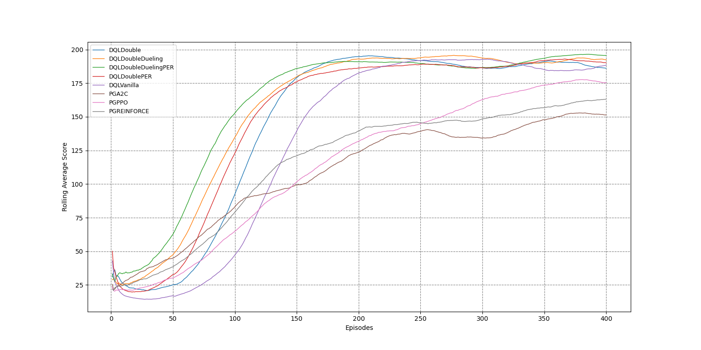
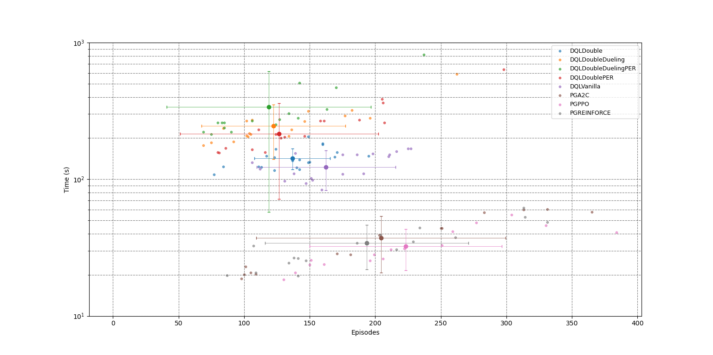
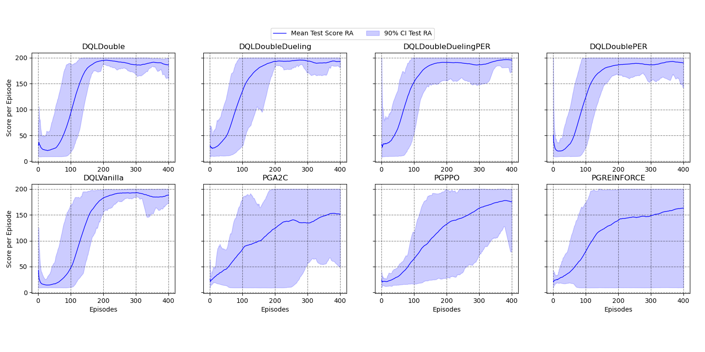
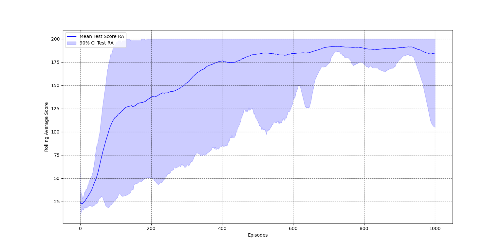

# On the use of reinforcement learning to play multiple Atari games

- First, we used the Open AI Gym library from python to get the environments working. Implementing a program capable of playing (randomly) on CartPole will be our first step.
- Second, we set up some useful functions to do reinforcement learning: building a storage function to collect the data of observations, taken actions, earned rewards...
- Third, we started by implementing a very easy Q-Learning algorithm to find the optimal policy to play CartPole, and see what performances we can reach on them.
- Fourth, we complexified the architecture of the agent with methods such as asynchronous actor critic (A2C) agents or advanced Deep Q -learning improvements to reach even better performances.

## Experiments

  We tried two different algorithms adn severall variatiosn for each one and compared their performances:
1. Policy gradient: Reinforce, A2C, Proximal Policy Optimization (PPO).
2. Deep Q-learning: Double Q-learning, Dueling Q-learning, Prioritized experience replay. 

  To ensure comparable results, we used one machine for all the computational work, and computed a bootstrap rolling average mean of performances over episodes and time. Due to computational power issues, for each variation on CartPole, we could not do more that:
- rolling average window: 50 episodes
- 20 computations
- 400 episodes

# results
Comparison of speed of convergence and stability on CartPole (200 is the best achievable score):

First time each method reached a score of 180 (out of 200) and training time:
One point is one computation, mean and standard deviation are displayed for each method.

Rolling average mean and 90% confidence interval for all methods. PPO stands for Proximal Policy Optimization, A2C for Asynchonous Actor Critic, PER for Prioritized Experience Replay.

Example of a complete evolution for 12C: 1000 episodes, 20 computations (total ~3h), rolling average window 50 episodes

# Conclusion
  This project aimed to identify differences between Policy Gradient method and Deep Q-learning, as well as some improvements for both algorithms. Based on our results:
  - Deep Q-Learning is more stable and more robust but Policy gradient converges faster over time. 
  - PG improvements we chose (A2C, PPO) reduce the uncertainty about the time required to converge. 
  - For Deep Q-learning, Double Q-Learning is a great improvement to converge in less episodes with almost no increase in computing time. 
  - Although Prioritized experience replay and Dueling architecture stabilize the learning and accelerate it in terms of episodes, it is not efficient in terms of training time. 
  - Unfortunately due to the low complexity of the Cart-pole problem, we could not link any increase or decrease in the final average score to the choice of methods and variations: they all reached scores above 190 at a point.
  
  A last advantage of PG methods over DQL methods is the small number of hyperparameters to be tuned. While this is clearly not an issue for a problem as easy as the Cart-Pole, it becomes infinitely important to actively tune the hyperparameters for more complex problem, and methods such as PG greatly simplify this process. 

  We believe that a good compromise would be to combine Policy Gradient and Deep Q-learning for more complex problems: Policy Gradient for on-policy learning and Q-learning for off-policy learning. The computing time would then be reduced but we would not fall into a local minimum for the loss function thanks to DQL. A similar algorithm called Deep Deterministic Policy Gradient was used by DeepMind to build and train AlphaGo, the famous algorithm that defeated the world Go champion in 2016 [14]. 
